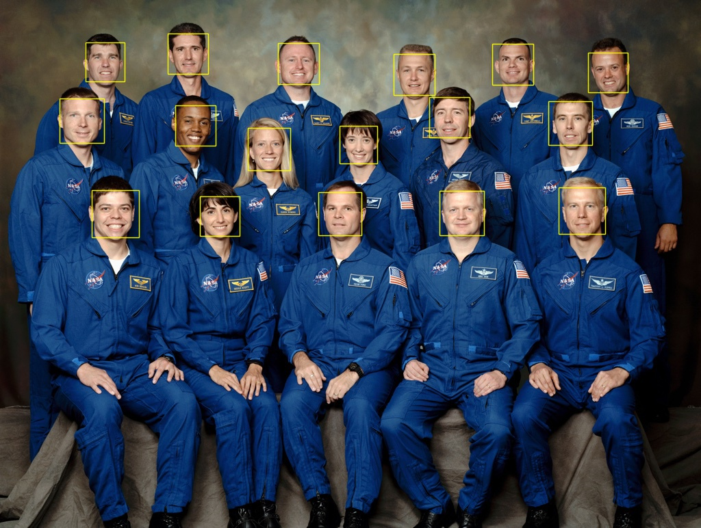

# Face Detection with OpenCV
Requires go-opencv template to build

```yaml
  facedetect:
    lang: go-opencv
    handler: ./facedetect
    image: nicholasjackson/func_facedetect
```

## Input
The input type of the function is controlled via a http header and accepts jpeg/png images, or base64 encoded jpegs and pngs.

## Output Coordinates
The face data is returned as an array of rectangles...

```bash
$ cat pic.jpg | faas-cli --gateway http://192.168.1.113:8080/ invoke facedetect
# or
$ cat pic.jpg | base64 | faas-cli --gateway http://192.168.1.113:8080/ invoke facedetect
```

```json
{
  "Faces":[
    {"Min":{"X":193,"Y":91},"Max":{"X":302,"Y":200}},
    {"Min":{"X":459,"Y":107},"Max":{"X":573,"Y":221}}
  ],
  "Bounds":{"Min":{"X":0,"Y":0},"Max":{"X":800,"Y":600}}
}
```

## Output Image
In addition to the raw data you can also choose to output an image with the faces boundaries drawn on it.  To enable this append the query flag with `output=image`

```bash
$ cat pic.jpg | faas-cli invoke --query output=image facedetect > out.jpg
```



## Developing
To test this function locally OpenCV is required this can be installed with `brew install opencv`

Then you need to ensure the environment variables are set with `source ./env.sh`
